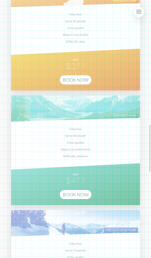

_0.1_ What it is about: Visually testing a literally single page application that reacts per CSS different to the following Browser Setups

- at different Media Breakpoints based on
  - width and/or
  - resolution and/or
  - touch capability
- at different Device Pixel Ratios
- at different Touch Modes
- at different Device Types(Mobile or Desktop)

  _0.2_ The application is really a single HTML page with sections summing up to multiples of `100 vh`(CSS for "hundredths of the viewport height"). But each section is not exactly `100 vh`(A point that i have a look at later).

  _0.3_ Target browsers are chrome and firefox(FF), as i prefer to be bound to desktop browsers available on
  Linux(so no Mac or Windows). Also as cloud based CIs for Windows and Mac are not so commonly supported and you have to take extra care for those in your project setup e.g. regarding file paths.

  _0.4_ Additionally, the project for the app has have two different Delivery Modes: Dev Mode and Prod Mode. Dev Mode is based on webpack-dev-server with hot reload. Prod Mode is physically compiled and served from a single dir. Beyond Dev Mode being served by a quite different base than Prod Mode, Dev Mode has a Mode dependent POSTCSS option which shows a visually translucent 32x32px grid in the browser.

  _0.5_ My use case with testcafe: Check for some combinations of

- browser settings
- browser vendors
- delivery modes

by screenshot to see if the app works visually as expected.

_0.6_ Now into the course of how my implementation should have run

1. How to configure Browser Setup
2. How to write test
3. How to take screenshot
4. How to automatically compare the actual screenshot against an expected base image

Currently i never came to the fourth point, as alone the first three were a time consuming and did not work as intended.

_0.7_ Finally i compiled some other observations, which go into the last chapter 'Other'

# 1 How To Configure Browser Setup

_1.1_ First takeaway for me was that by only supplying browser CLI arguments ala chrome's `window-size` do
not get you something when it comes to above Browser Setup list. That meant for
chrome to check out the emulation options wrapped by testcafe, which cover all of the above Browser Setup requirements.

_1.2_ But on firefox i was first clueless - there is no CLI for emulation mode. So i prepared an own FF profile prior to startup. Along with the automatic removal of the tmp profile(which btw did not work consistently as does testcafe's), I did some amount of copying testcafe's firefox profile handling procedure (Enhancement #1).

_1.3_ On that way i also converted from package.json driven testcafe parameters to testcafe's programmatic
runTestCafe approach. As the browsers array therein was initially not pretty either, i wrapped that in a Builder pattern (Enhancement #2) with my sensible defaults and hiding/harmonizing Browser Setups e.g.

```js
;(await new ChromeBrowserConfig.Builder().withWidth(600).build()).output()
```

Where `output()` renders the browser configuration to the per testcafe expected string format.

_1.4_ _[Rant] That `await` before `new` is so cruel as anything in Node that is trapped by using a single async function anywhere below, and wants to continue sync again._

_1.5_ Still, how to set width/height for the media breakpoints in FF were not clear to me. `t.resizeWindow` documents itself as `Sets the browser window size.` How does that help to meet the viewport size?

_1.6_ To peek how all this is handled with chrome I discovered testcafe's `setEmulationBounds` using CDP's `setDeviceMetricsOverride` and `setVisibleSize`.

_1.7_ Tried to make sense out of that one's documentation at
https://chromedevtools.github.io/devtools-protocol/tot/Emulation/#method-setDeviceMetricsOverride.
Describes iteself as

> `Overrides the values of device screen dimensions(window.screen.width, window.screen.height, window.innerWidth, window.innerHeight, ...`

Whaaaat? For me it looked like, and after researching still is, a complete specification naming disaster followed by a browser vendor interpretation disaster.

_1.8_ Along i tried to make sense out of
https://chromedevtools.github.io/devtools-protocol/tot/Emulation/#method-setVisibleSize. `Resizes the frame/viewport of the page. ...` Whaaaat? _Which is btw currently marked as "experimental" and
"deprecated"(Issue #1)._

_1.9_ Out of those two and other references - of whom i would like to highlight https://www.quirksmode.org/blog/archives/2013/12/desktop_media_q.html - i chrocheted a mental model, which boils down to

```
                 window.innerWidth x window.innerHeight
                 = The browser's inner window
```

where this includes the width/height of the eventual scrollbar(s). This one would kick in on CSS media breakpoints defined by `device-width/device-height`(which i do not use). For the mobile Device Type, these are referenced as visual viewport dimensions.

_1.10_ While the viewport - a special term for a conceptual rectangle area that does not change while zooming, but only somewhat setable via the HTML `meta viewport` tag -

```
                document.documentElement.clientWidth x document.documentElement.clientHeight
                = The browser's inner window's viewport
```

contains the root element, like <html>, and does not include the scrollbars. This one kicks on
CSS media breakpoints defined by width/height. In mobile mode, these are referenced as the layout
viewport dimensions.

_1.11_ So, i have written a length about finding out how make chrome matching CSS Media query boundaries in emulation mode. But what about FF, having no emulation mode? Turns out that only if you run FF via marionettePort(which is tescafe's default of operation), `t.resizeWindow` first fetches

```
width: window.innerWidth,
height: window.innerHeight,
outerWidth: window.outerWidth,
outerHeight: window.outerHeight,
availableWidth: screen.availWidth,
availableHeight: screen.availHeight
```

_1.12_ Then it calls FF's `getWindowRect` (which i assume to be `window.outerWidth`), calculates the diff between `currentRect.width/height` and `window.innerWidth/Height` and adds that to the width/height given to `t.resizeWindow` and sends that via marionette's `setWindowRect`(which eventually succeeds, see sources about cases where that value is too small or too big).

_1.13_ _If this conclusion is right, i vote that t.resizeWindow should be aliased renamed (resizeInnerWindow), documented as such and sensible variants (outer,...) should be built into testcafe(Issue #2)_

_1.14_ And so one can expect to have `window.innerWidth/Height` been set via `t.resizeWindow` - which is the same as we accomplished via CDP's `setDeviceMetricsOverride`.

_1.15_ But still, will I never have the viewport related media query kicking in FF? To check on that, turned out that resizing at the 0/+1 pixel cases on one of my media query width's, the media query kicked in?!?!

_1.16_ Turns out that https://www.quirksmode.org/blog/archives/2013/12/desktop_media_q.html also made the following related observation about some desktop browser vendors

> The width and height media queries are no longer slaved to `document.documentElement.clientWidth/Height`. Instead, they take their cues from `window.innerWidth/Height`. This means desktop browsers now treat these media queries differently than mobile browsers.

_1.17_ You can observe this effect with your chrome or FF browser by opening
https://www.quirksmode.org/css/tests/mediaqueries/width.html, which still proves what was written in
2013! Hmmm. In chrome's Toggle Device Mode, the result of https://www.quirksmode.org/css/tests/mediaqueries/width.html changes when you toggle the Device Type from desktop to mobile. In FF in Responsive Design Mode, the result changes too. So, FF's Responsive Design Mode == Chrome's Device Type's Mobile mode? Dunno FF, anyone anywhere documented?

_1.18_ So, using `t.resizeWindow` seems to be working for FF. But wait a second, if the same test should run under chrome and FF, does `t.resizeWindow` for FF interfere with chrome in emulation mode? Turns out that i was in luck again. `t.resizeWindow` for chrome in emulation mode syncs with the set parameters.

# 2 How to write test

_2.1_ Overall point is that, inside your test, you have no access to the args of the run (the ones used in `runTestCafe`) or the configuration of the browser instance currently run. Examples where this would be beneficial

- set viewport width and height (see chapter "How To Configure Browser Setup")
- check that the configuration of the Browser Setup aligns to the related current browser instance
- build a subdirectory for screenshots for each running browser instance

_2.2_ Infos from the run - that is all about args, browser instance and current test are already orderly parsed and evaluated - are held in sync by testcafe and are expected to be properly unit tested. But these infos are not (officially) accessible for the end user, meaning effort of dabbling live code and source code and leads to overall bad practices(code duplication or reaching into not public API).

_2.3_ So i presume that there are public APIs lacking. Let me show you two examples of usage.

_2.4_ First one, as explained before, is for FF i need to call `t.resizeWindow` with a height and width. Therefore i put the run arguments on the testcafe browser configuration, even, like `scaleFactor` or `touch`, they do not exist as FF CLI params. But first, are enacted for building a proper FF profile.

`"firefox:headless:marionettePort=42939 -profile /tmp/testcafe-ext/firefox-profile-309573pwGWM1c30Pe -width=600 -height=1024 -scaleFactor=2 -touch=true -mobile=false"`

_2.5_ Second one, in my test i do

```js
const runArgsBrowser = await evaluateRunArgsBrowser(t)
await resizeToRunInfoDimensions(t, runArgsBrowser)
```

Where `runArgsBrowser` are evaluated

```js
const HEIGHT_RUNINFO_RE = /(?:height=)([0-9]+|$)/
const WIDTH_RUNINFO_RE = /(?:width=)([0-9]+|$)/
...
/**
 *
 * @param {TestController} t
 * @return {Promise<RunArgsBrowser>} runArgsBrowser
 */
const evaluateRunArgsBrowser = async function(t) {
  /**
   * @type {RunArgsBrowser}
   */
  const result = {}

  const runArgsBrowser = await t.testRun.browserConnection.browserInfo.alias

  result.height = evalRegexAsInt(HEIGHT_RUNINFO_RE, runArgsBrowser)

  result.width = evalRegexAsInt(WIDTH_RUNINFO_RE, runArgsBrowser)
  ...
```

As you can see in `evaluateRunArgsBrowser`, i dabbled into testcafe's not public API and parsed the browser run args myself. Can't remember where, but i saw testcafe code that does exactly that kind of parsing already.

_2.6_ Second example of usage was organizing screenshots into folders respective to the browser instance under test. Could not employ testcafe's screenshot pattern for this. Finally dabbled again into testcafe's not public API and modeled a folder path from test and testcase down to the browser instance setup under test, including user agent info(also mostly a duplication of what testcafe already implemented). See following for result

```
joma@edison:target $ tree
.
├── reports-dev
│   ├── report.xml
│   └── screenshots
│       └── Index_Page_Test
│           └── take_screenshots
│               ├── chrome_linux_600x1024_mob#true_dpr#1_tou#true
│               │   ├── footer.png
│               │   ├── header.png
│...
│               │   ├── section-tours.png
│               │   └── thumbnails
...
│               ├── chrome_linux_601x1024_mob#true_dpr#1_tou#false
│               │   ├── footer.png
│               │   ├── header.png
│...
│               │   ├── section-tours.png
│               │   └── thumbnails
...
│               ├── firefox_ubuntu_590x1024_mob#false_dpr#1_tou#true
│               │   ├── footer.png
│               │   ├── header.png
│...
│               │   ├── section-tours.png
│               │   └── thumbnails
...
│               └── firefox_ubuntu_591x1024_mob#false_dpr#1_tou#false
│                   ├── footer.png
│                   ├── header.png
│...
│                   ├── section-tours.png
│                   └── thumbnails
...
└── reports-prod
    ├── report.xml
    └── screenshots
        └── Index_Page_Test
            └── take_screenshots
                ├── chrome_linux_600x1024_mob#true_dpr#1_tou#true
                │   ├── footer.png
                │   ├── header.png
│...
                │   ├── section-tours.png
                │   └── thumbnails
...
                ├── chrome_linux_601x1024_mob#true_dpr#1_tou#false
                │   ├── footer.png
...
...
```

# 3 How to take screenshot

_3.1_ The overall goal was to take a screenshot of each section. So i implemented it as a command pairs per section of

```js
await scrollTo(t, "body > main > section.section-about")

await takeScreenshotAtRunInfoContext(t, "section-about.png")
```

_3.2_ Where `scrollTo` includes an assertion of whether the selected element exists and then uses browser dom's `elm.scrollIntoView(options)` via a `ClientFunction` to per default center the selected element on the browser window. And `takeScreenshotAtRunInfoContext` essentially evalutes the path the resulting scrensshot image should be taken to(see above organisation of the screenshot folder structure).

## 4 Screenshot Image Can Have Smaller Dimensions Than Requested By Browser Setup

_4.1_ What i first observed is that the returned screenshot images did pixelwise not match the desired Media Breakpoint width, but where smaller. First i thought that there is something going wrong and that i have to adjust to programmatically. Then is understood that screenshots where delivered by testcafe without the scrollbars. At least if there is some browser info about an active displayed browser scrollbar, so i think testcafe is accounting for `document.documentElement.clientWidth`.

_4.2_ I wrote "At least" as i have proof that chrome in emulation mode does display a scrollbar, which seems not to be accounted for as scrollbar. It's overlaying above the display and is shown or not shown according to some chrome intern behaviour.



_4.3_ For all of this i feel a relevant testcafe documentation is missing.

_4.4_ In the course of this i would like to discuss what the arguments for deciding to not include scrollbars in screenshot were on testcafe's team.

_4.5_ My argument is that scrollbars are part of the interface, even design(yes, you can style those afaik non-standardized) and definitely user experience. Scrollbars are part of the factual expression of the display. Excluding those from screenshots is like dismissing characters of the log request message after the 100th, just because someone thought her editor's maximal line length is 97.

_4.6_ I would see both behaviours as options in the screenshot API.

## 5 Screenshot API For Fullscreen

_5.0.1_ Here i propose screenshot facilities that screenshots the full page or a selected element, so to screenshot not only what is displayed in the actual browser window's viewport.

_5.0.2_ As of writing i know that current browsers Chrome and FF support full page screenshots via CDP and Marionette.

_5.0.3_ FF does it's job pretty well, while totally undocumented. I changed the code in testcafe to use an additional parameter to the FF's screenshot call(lost the code after an update, but may reconstruct it on demand). Got the full page screenshot immediately, and as far as i can say - regarding sticky positioned elements and my multi `vh` app - looked correct to me.

_5.0.4_ Chrome, on the other side, does it's job not very well. First, there is no direct function call, you have to be in Emulation mode and fiddle around with Emulation related calls and parameters(see above described usage of `setDeviceMetricsOverride`).

_5.0.5_ And second, because of how that is implemented in Chrome, the change of the height done therefore affects the viewport size(sic!), which subsequently affects the browser's `vh` calculation. So all i got was a brutally sized first section (having a size of `100 vh`) of my app - see image on the left.

_5.0.6_ With a height that normally covers all of my sections and what is expected - see image on the right.


### 5.1 My Chrome VH Workaround

_5.1.0_ Workaround i found is only by refactoring the app's css to grind all `vh` values over one single css variable. So i made a special css variable `--vh`, which, by default, get's a aliased value of 'the real `1vh`'&copy;&reg;

```css
$accnat-header-height-cf-sm: calc(var(--vh, 1vh) * 100);
```

_5.1.1_ So to scheme for further enablement of a full page screenshot in Chrome, just before when i would be about taking a screenshot, i first would measure the actual value of `1vh`

```js
const actualVh = window.innerHeight / 100
```

_5.10_ and then set this css variable e.g.

```js
document.documentElement.style.setProperty("--vh", actualVh + "px")
```

_5.10_ and then evaluate the body's bounding box again. I assert that the height of the body's bounding box before is the same as just taken.

_5.11_ After taking the screenshot, i unset the css variable

```js
document.documentElement.style.removeProperty("--vh")
```

### 5.2 Chrome Screenshot/DeviceMetricsOverride Issue Parade

_5.2.0_ Issue #1 There are Chromium Issues about `setDeviceMetricsOverride` affecting viewport size. These are all turned down with 'wont fix'. See https://crbug.com/761136 for example.

_5.2.1_ Issue #2 I observed the same behaviour as Issue #1 when using the option 'Capture full size screenshot' via Chrome Developer Tools. As being not documented, or at least not able without digging deeper, i presume that 'Capture full size screenshot' internally uses `setDeviceMetricsOverride`.

_5.2.2_ Issue #3 Only when hardware accleration in chrome is set to off, are screenshots returned reliable(else transparent or black image) and with the intended height(sic!, otherwise see following image). For this, Chrome may be started into this mode also via the CLI `--disable-gpu` parameter.


_5.2.3_ Issue #4 A pure change via `setDeviceMetricsOverride` for height and viewport height does trigger a change in width(sic!), so that the layout changes. This happens on one of my systems, same code on another system, does not. Even when hardware accleration is set to off.

_5.2.4_ This issues and workarounds are not proper, and in my situation of the app i feel this comes very close to a show stopper.

## Discussion About Usage Of Full Page Screenshot

Issue - When full page screenshot is taken, scrollbars disappear. This is a conceptual problem.

# 6 Other

## 6.1 Document Browser Setup In Relation To Testcafe Behaviours

_6.1.1_ As can be seen in the pargraphs of the Browser Setup chapter, overall testcafe lacks documentation under which condition which behaviour is shown in which browser vendor. Read e.g.

- chrome with and without emulation
- FF with and without marionette port and/or with and without own profile
- other browsers without a built-in browser plugin

_6.1.2_ Example #1

> Starting FF via testcafe defining an own profile, testcafe will not use FF's marionette protocol. One has to set the marionette port explicitly on the command line.

_6.1.3_ Example #2

> Starting FF in non-headless mode, testcafe does not allow you to set a marionette port to it's options. Which it should offer, if you define an own FF's profile. Instead, a testcafe's own marionette client with some other port is opened.

## 6.2 Explain Testcafe Under-The-Hood

_6.2.1_ Another point about my understanding of testcafe is that - as one might presume falsely by now speaking at length about Chrome's CDP 1.3(as of writing) or FF's Marionette ?.?(latest, do not know) - testcafe is not just yet another wrapper over those.

_6.2.2_ Many of the other testcafe commands are routed via a JS proxy(hammerhead) directly into/onto the browser instance running the application under test. In the whole documentation of testcafe this point is never mentioned and AFAIK is very unique.

_6.2.3_ Would love to hear from tescafe folks about their architectural decision process and detailed pros and cons comparing to w3c driver spec or other competitive products. This would be beneficial for decisions about the ins and outs when evaluating or proposing for an adoption.

## 6.3 Explain Testcafe Supports Only Latest Browsers

Also lacking is a more prominent section about why testcafe supports only the latest browser
versions. As above, this would be beneficial for decisions.

## 6.4 Evalute Need That Testcafe Delivers ES3 Code

Why does testcafe deliver transpiled es3 code? `Promises` are resolved to some promisify framework :frowning:, whatever that does. Thing is, it makes debugging testcafe for me quite difficult. While delivered with source mappings, this is rather bothersome, from initial setting breakpoints till the source mapping is recognized to funny line jumps while debugging to stepping through nested technical crutch sources i am not interested in.

## 6.5 Provide ESM For User Test

Testcafe already uses `esm` underneath. Would like support for es6 modules in node for my tests too. Had to learn to run my runTestCafe via `node -r esm src/tests/run-testcafe`. Why not defaulting?

## 6.6 Enhance Logging

Tracing what testcafe does while running a test in between is - well - not existing. Proposal is some debug level that shows timestamped console messages like "Starting browser", "Started browser", "Taking screenshot" with proper relation to test and browser instance.

## 6.7 Make Browser Window Relateable To Current Run

If you debug tests with more than one browser, one can not relate which browser belongs to the current instance of the test. Proper relation with logging chalk color and browser window chrome color, by PID and debugging port ... See also "Enhance Logging".

## \_6.8 T_est Report Esp Xunit Flavor Does Tell You Not Enough

_6.8.1_ From the below test report of a contrived test - can you guess which Browser Setup did fail? How does that browser agent identifier(`Chrome 76.0.3809 / Linux 0.0.0`) relate to my Browser Setup t.i. was it `chrome_linux_600x1024_mob#true_dpr#1_tou#true` or `chrome_linux_601x1024_mob#true_dpr#1_tou#false` that broke?

_6.8.2_ How can i undefault the folder placement of the error screenshot? If there occur two of them under the same browser agent identifier, they would have overridden each other.

_6.8.3_ I would not prefer the result of all browsers accumulated into one testcase. I think this is called a parameterized test. So

- How about a report per browser paramater?
- Or put the browser parameters to the test behind in the test name e.g.

```xml
<testcase classname="Index_Page_Test" name="take_screenshots (Chrome_76.0.3809_Linux_0.0.0_mob#false_dpr#1_tou#false)" >...</testcase>
<testcase classname="Index_Page_Test" name="take_screenshots (Chrome_76.0.3809_Linux_0.0.0_mob#false_dpr#1_tou#true)" >...</testcase>
```

_6.8.4_ Also let users define the testsuite name.

_6.8.5_ Then, user defined properties would be nice e.g.

```xml
<properties>
    <property name="mobile" value="true"/>
    <property name="devicePixelRatio" value="2"/>
    <property name="touch" value="true"/>
    <property name="screenshots" value="/home/joma/entwicklung/design/acc-natours/target/reports-prod/screenshots/Index_Page_Test/take_screenshots/firefox_ubuntu_591x1024_mob#false_dpr#1_tou#false"/>
    <property name="browserId" value="Qs4wd5"/>
    <property name="browserName" value="firefox"/>
    <property name="browserVersion" value="68.0.0"/>
    ...
</properties>
```

_6.8.6_ For logging reasons above, it makes sense to grab console error and std out to the report too.

_6.8.7_ Wondering why is one in tge report counted as failure, and the other as error? And only one error screenshot `target/reports-prod/screenshots/Index_Page_Test/take_screenshots/HeadlessChrome_76.0.3809_Linux_0.0.0/errors/1.png` is taken. Or should that be named failure screenshot?

```xml
<?xml version="1.0" encoding="UTF-8" ?>
<testsuite name="TestCafe Tests: Chrome 76.0.3809 / Linux 0.0.0, HeadlessChrome 76.0.3809 / Linux 0.0.0, Firefox 68.0.0 / Ubuntu 0.0.0, Firefox 68.0.0 / Ubuntu 0.0.0" tests="1" failures="1" skipped="0" errors="1" time="38.697" timestamp="Fri, 02 Aug 2019 19:13:30 GMT" >
  <testcase classname="Index_Page_Test" name="take_screenshots (screenshots: /home/joma/entwicklung/design/acc-natours/target/reports-prod/screenshots/Index_Page_Test/take_screenshots)" time="38.628">
    <failure>
    <![CDATA[
      1) AssertionError: expected false to be truthy

         Browser: Firefox 68.0.0 / Ubuntu 0.0.0
         Screenshot:
      /home/joma/entwicklung/design/acc-natours/target/reports-prod/screenshots/Index_Page_Test/take_screenshots/Firefox_68.0.0_Ubuntu_0.0.0/errors/1.png

            50 |  await scrollTo(t, "body > main > section.section-tours")
            51 |
            52 |  await takeScreenshotAtRunInfoContext(t, "section-tours.png")
            53 |
            54 |  if (getRunInfoCtx(t).runArgsBrowser.isTouchEnabled == false) {
          > 55 |    await t.expect(false).ok()
            56 |  }
            57 |
            58 |  await t.hover(
            59 |    "body > main > section.section-tours > div.row > div:nth-child(1) > div.card",
            60 |  )

            at ok (/home/joma/entwicklung/design/acc-natours/src/tests/index-test.js:55:27)

      2) AssertionError: expected false to be truthy

         Browser: HeadlessChrome 76.0.3809 / Linux 0.0.0
         Screenshot:
      /home/joma/entwicklung/design/acc-natours/target/reports-prod/screenshots/Index_Page_Test/take_screenshots/HeadlessChrome_76.0.3809_Linux_0.0.0/errors/1.png

            50 |  await scrollTo(t, "body > main > section.section-tours")
            51 |
            52 |  await takeScreenshotAtRunInfoContext(t, "section-tours.png")
            53 |
            54 |  if (getRunInfoCtx(t).runArgsBrowser.isTouchEnabled == false) {
          > 55 |    await t.expect(false).ok()
            56 |  }
            57 |
            58 |  await t.hover(
            59 |    "body > main > section.section-tours > div.row > div:nth-child(1) > div.card",
            60 |  )

            at ok (/home/joma/entwicklung/design/acc-natours/src/tests/index-test.js:55:27)
    ]]>
    </failure>
  </testcase>
</testsuites>
```

## 6.9 Auto Fetch Standard DOM Properties Per HTML Element Type

What to auto fetch for eg HTMLImageElement; see `lib.dom.ts` for properties.

```js
/** Provides special properties and methods for manipulating  elements. */
interface HTMLImageElement extends HTMLElement {
    ...
    readonly complete: boolean;
    readonly naturalHeight: number;
    src: string;
    srcset: string;
    ...
}
```

Do not know if there is a performance or memory penalty.

## 6.10 Debugging Chrome in headless mode should be allowed

Chrome allows more than one session, so even in headless mode i was in need to use it. I know that this imposes a certain risk, t.i. having debug statements while running the test in CI. Would like to discuss that.

## 6.11 Support more TS type flowing

I know, the following TS hints make this look like complete madness. And it is. But it makes usage so more fool proof.

Perhaps testcafe can offer some built-in support for such.

```js
/**
 * Selects
 *
 * @param {string} imgSelector
 * @return the selected img element by the given imgSelector
 */
const selectImg = async (imgSelector) => {
  /** @type { SelectorAPI & HTMLImageElement} */
  const result = await /** @type { ? } */ (Selector(
    imgSelector,
  )).addCustomDOMProperties({
    // @ts-ignore
    complete: (/** @type {HTMLImageElement} */ el) => {
      return el.complete
    },
    // @ts-ignore
    naturalHeight: (/** @type {HTMLImageElement} */ el) => el.naturalHeight,
    // @ts-ignore
    naturalWidth: (/** @type {HTMLImageElement} */ el) => el.naturalWidth,
    // @ts-ignore
    currentSrc: (/** @type {HTMLImageElement} */ el) => el.currentSrc,
  })
  return result
}
```

Usage

```js
const about_comp_img_3 = await selectImg(
  "body > main > section.section-about > div.row > div:nth-child(2) > div > img.composition__photo.composition__photo--p3",
)

await t.expect(about_comp_img__3.c_omplete).ok()

if (getRunInfoCtx(t).runValuesBrowser.dpr >= 2) {
  await t.expect(about_comp_img_3.currentSrc).contains("nat-3-large.")
} else {
  await t.expect(about_comp_img_3.currentSrc).contains("nat-3.")
}
```

## 6.12 Make display position of testcafe's debug footer configureable

Happens that i am testing for browser dimensions that are wider/taller than is available on my monitor. Browsers seem to always open so that their top is within bounds of the screen. As the debug footer being at the bottom, i often have to move the browser window to access to the actions on the debug footer. Which is kind of bothersome.
